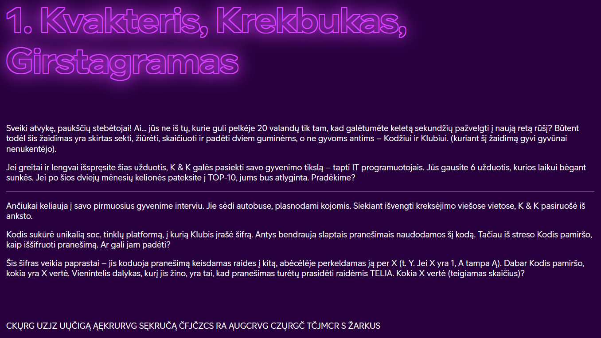
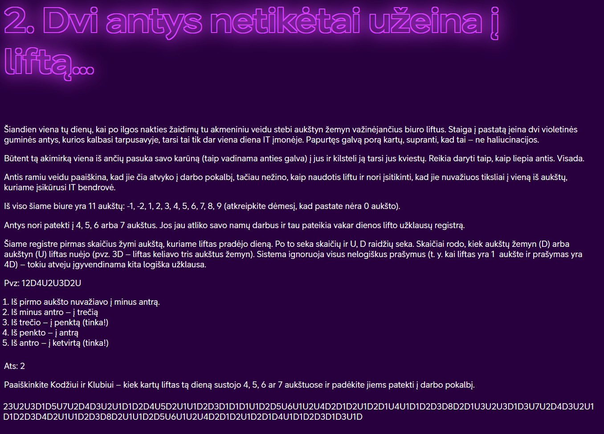
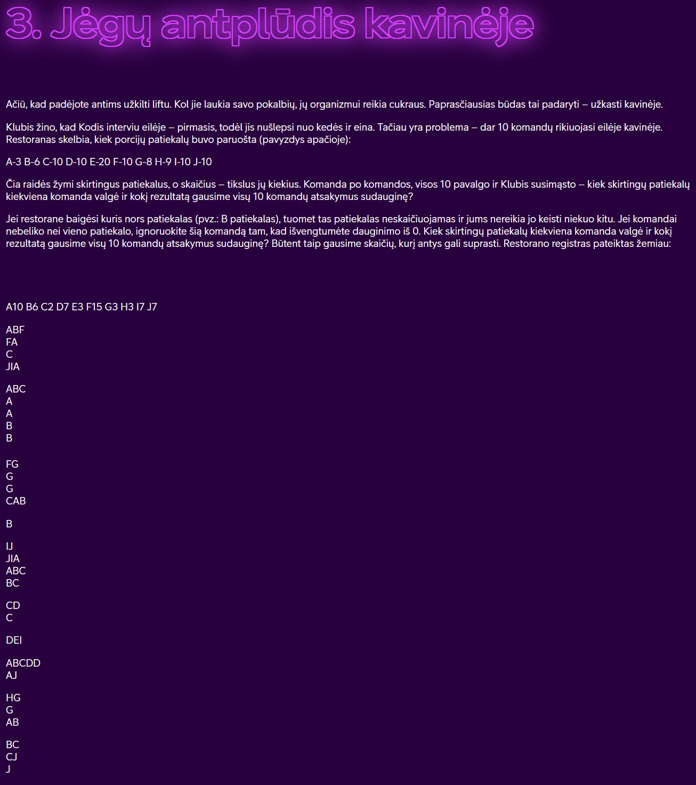
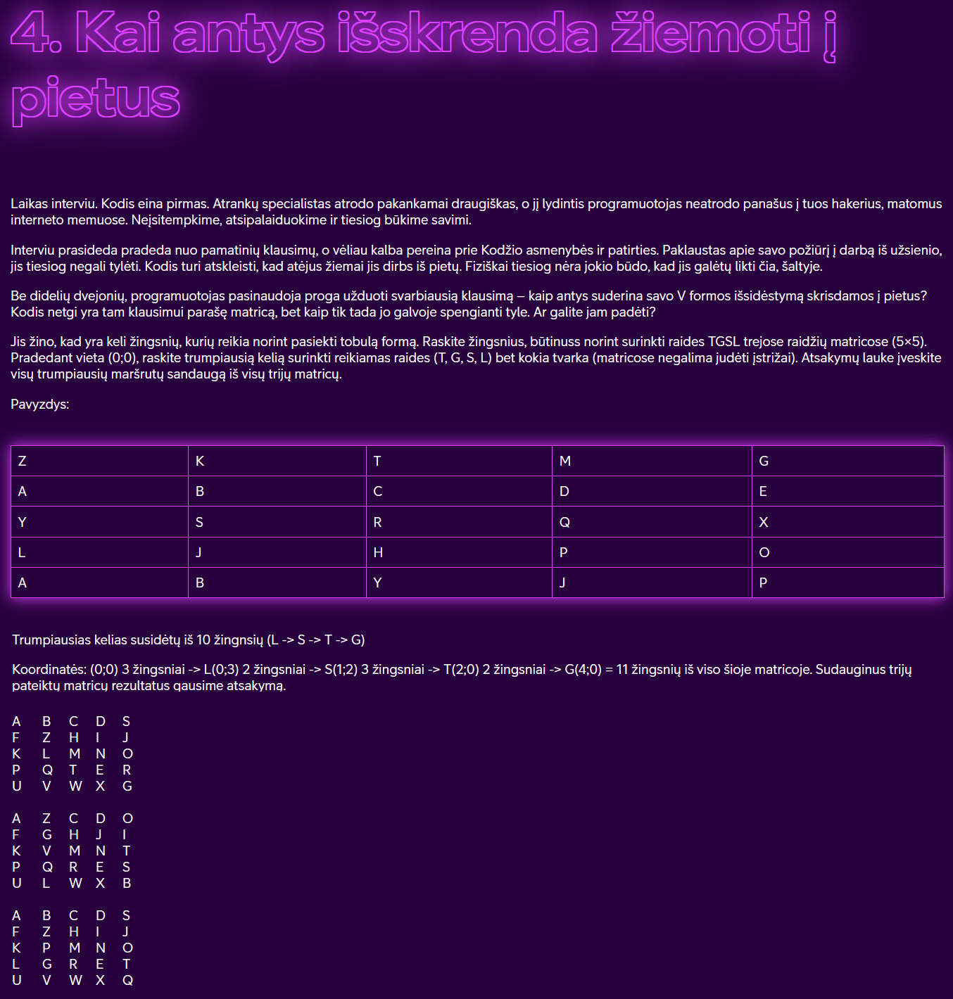
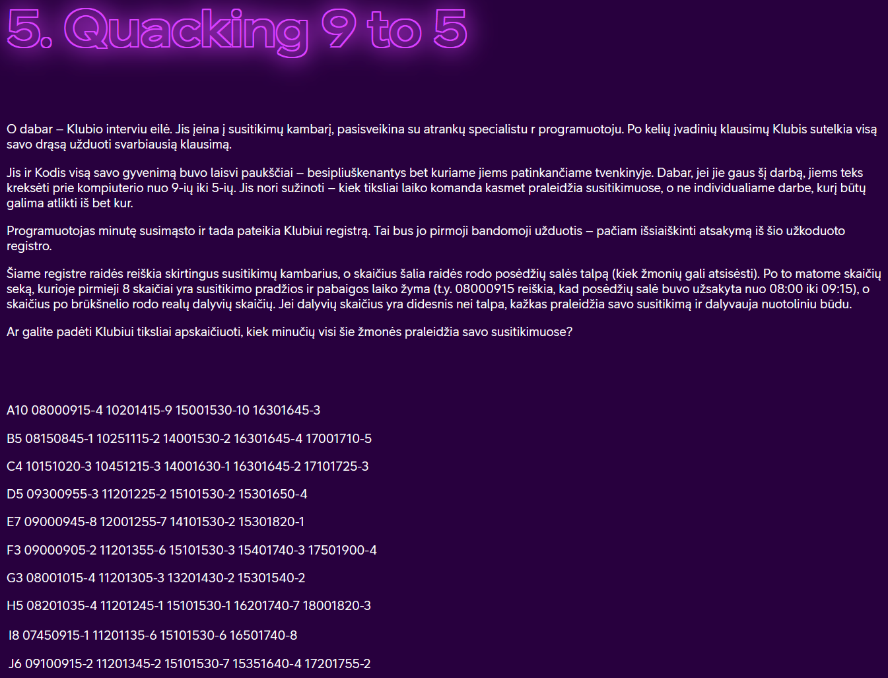
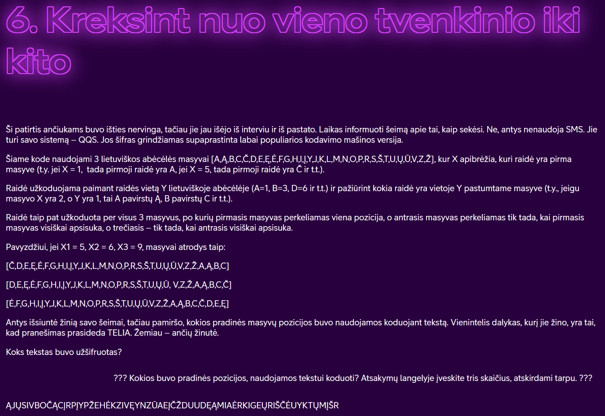

# Kodo Klubas

Užduotys iš https://kodoklubas.lt

KODO klubas – tai išskirtinė IT specialistų bendruomenė, kurią vienija siekis rasti atsakymus sudėtingiausiems iššūkiams ir taip padėti milijonams vartotojų.

## Install

Install golang https://go.dev/doc/install

Clone repo using git

`git clone https://github.com/youstinus/kodo-klubas.git`

Or

Get package with Go

`go get github.com/youstinus/kodo-klubas`

## Run

`go run ./cmd/uzduotis1`

`go run ./cmd/uzduotis2`

`go run ./cmd/uzduotis3`

`go run ./cmd/uzduotis4`

`go run ./cmd/uzduotis5`

`go run ./cmd/uzduotis6`

OR

`make pirma`

`make antra`

`make trecia`

`make ketvirta`

`make penkta`

`make sesta`

## Run All

`make all`

OR

`make allgo`

## Užduotys

[cmd/uzduotis1](cmd/uzduotis1)

[cmd/uzduotis2](cmd/uzduotis2)

[cmd/uzduotis3](cmd/uzduotis3)

[cmd/uzduotis4](cmd/uzduotis4)

[cmd/uzduotis5](cmd/uzduotis5)

[cmd/uzduotis6](cmd/uzduotis6)

